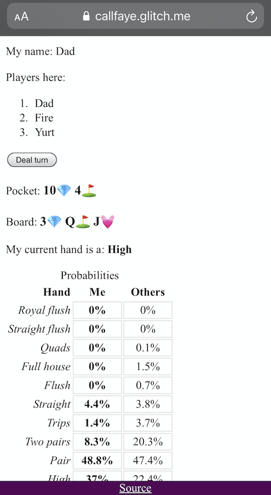

# Call Faye: Texas hold 'em helper

See the blog post, [Learning about risk, for kids and grownups](https://fasiha.github.io/post/risk-for-kids-and-grownups/), but in a nutshell, this repository contains 
- a Texas hold 'em hand anumerator and analyzer, and
- a web application to facilitate in-person poker play by showing players their odds as they deal cards—you have to track bets and folds yourselves in meatspace. Easy to deploy on your own cheap web server solution.

Play at **https://callfaye.glitch.me/**. 

Here's what the app looks like on mobile:



To play:
- Familiarize yourself with Texas hold 'em basics: [Pagat](https://www.pagat.com/poker/variants/texasholdem.html)
- Go to https://callfaye.glitch.me/
- (open multiple tabs if you don't have a friend hany)
- Get everyone to enter the same table name
- Get everyone to click 'Announce'
- All players will see each other
- Anyone can deal cards by clicking the appropriate button
- Your hand's probabilities for each final hand ranking will be printed out in a table
- Your probabilities will be accompanied by other players' probabilities for each rankings also (taking into account the fact that they can't have your pocket cards)
- You and your friends take care of betting and folding.

## Installation and run
Ensure you have both [Git](https://git-scm.com/) and [Node.js](https://nodejs.org/) installed. Then run the following set of commands in your command-line prompt  (i.e., Terminal in macOS, xterm in Linux, Command Prompt in Windows, etc.):
```console
git clone https://github.com/fasiha/hold-em-tools.git
cd hold-em-tools
npm install
npm run build
```
The `git` command comes from the eponymous program you have installed, while `npm` was installed by Node.js.

Then, to start the Call Faye server, run
```
npm run start
```

To run on Glitch, simply clone this repository and it should work.

## Dev
### Beckend serve
The server runs a Socket.io server that just connects together clients at the same poker table. It knows absolutely nothing about poker.

### Frontend client
The frontend is a MobX & React app, residing in `client.ts`. It leverages `playerHelper.ts` to compute probabilities of final hand rankings at each point in the game, either using the pre-computed data or re-computing on the fly. It requires pre-computed enumerations of final hand rankings' probabilities for all 2- and 3-card combinations, because these take too long to compute on the fly. *These are included in the repository*, but if you want to regenerate them, run
```
node skinnyRank.js
```
This will recreate `map-r-7-n-2.json` and `map-r-7-n-3.json`. It might take several hours, but only has to be done once.

Each client sends and receives messages to the table, which the backend shares with all other players. The user who clicks "Deal flop" generates a random seed that is shared with all other players. So each player's client knows what cards others have but just hides it from them until the showdown. This works well for local games, where you can trust all players to not run custom JavaScript code and cheat.
